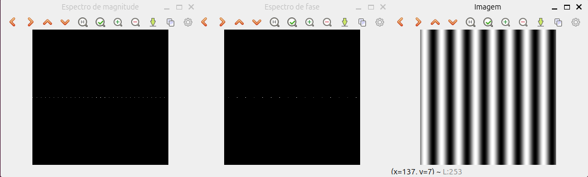
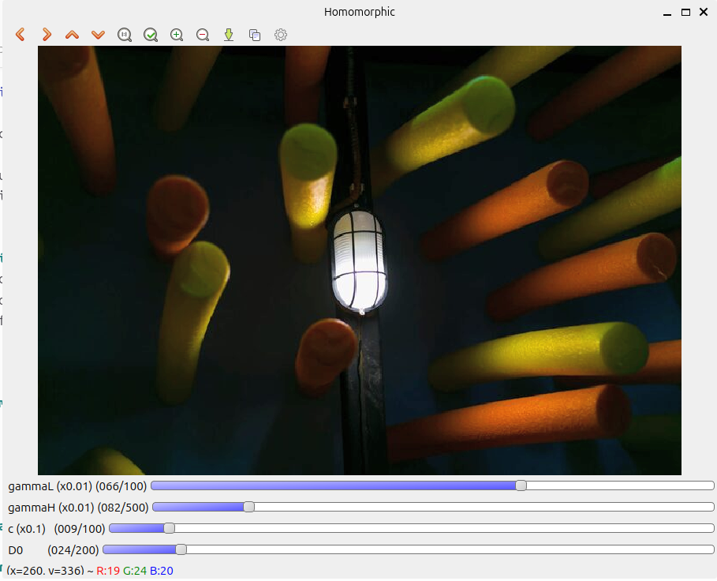
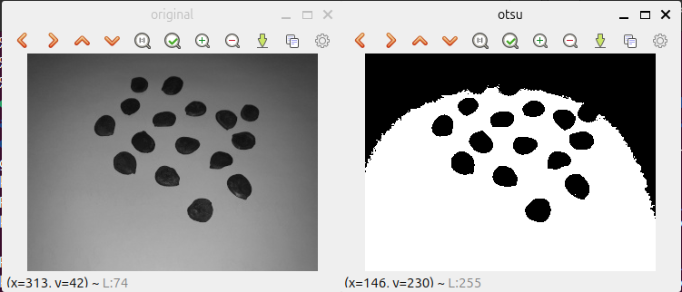
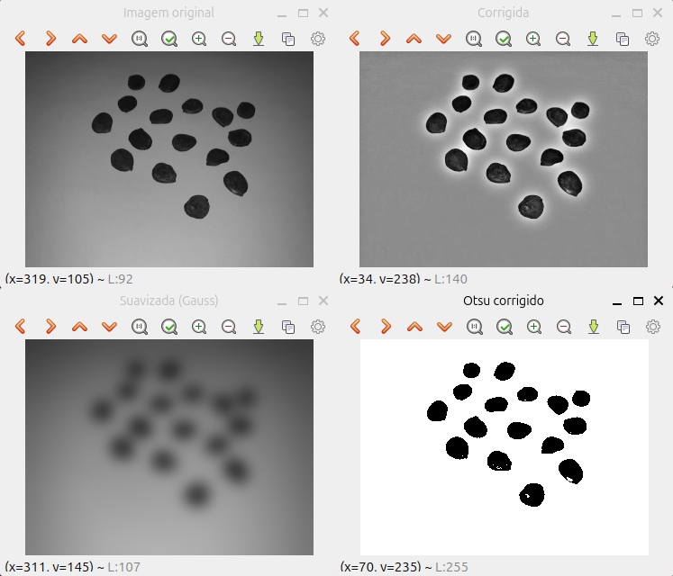

= Atividades - Unidade II
:stem: latexmath
:doctype: article
:mathjax-cdn: https://cdn.jsdelivr.net/npm/mathjax@3/es5/tex-mml-chtml.js

[cols="1,3", frame="topbot", grid="none"]
|===
|Autor: |Ítalo Maciel de Paiva
|Curso: |Engenharia da Computação
|Instituição: |Universidade Federal do Rio Grande do Norte
|Docente: |Agostinho Brito Júnior
|Github: |link:https://github.com/italomacielp/Processamento_Digital_de_Imagens_Unidade_II[Repositório no Github]
|===

:toc: left
:toc-title: Sumário

== Introdução
Este relatório apresenta a resolução das questões propostas na segunda unidade da disciplina de *Processamento Digital de Imagens*, incluindo a análise dos resultados obtidos e a fundamentação teórica correspondente.

== Desenvolvimento/Análise de Resultados

Esta seção contém a execução e a análise detalhada dos resultados obtidos em cada um dos capítulos abordados, que cobrem a segunda unidade da disciplina.

=== Capítulo V - Processamento de Imagens no Domínio da Frequência

==== Transformada Discreta de Fourier
*Questão 1:* Utilizando os programa exemplos/dft.cpp, calcule e apresente o espectro de magnitude da imagem Figura 42, “Imagem senoidal com 256x256 pixels”.

O resultado obtido após compilar/executar o arquivo *dft.cpp* pode ser visualizado na imagem abaixo:

*Questão 2:* Compare o espectro de magnitude gerado para a figura Figura 42, “Imagem senoidal com 256x256 pixels” com o valor teórico da transformada de Fourier da senóide.

*Resposta*:
A Transformada de Fourier de uma senóide pura apresenta apenas dois picos simétricos no espectro de magnitude, posicionados em (+f_x,0) e (-f_x,0). Isso ocorre porque a senóide contém apenas uma frequência fundamental, sem variação vertical, e sua energia fica concentrada em pontos específicos do domínio da frequência. O espectro de fase, nesse caso, apenas indica o deslocamento da onda, sem alterar a posição dos picos. Assim, a representação teórica é simples: dois impulsos bem definidos que refletem a periodicidade suave da senóide.

Na imagem analisada, composta por listras verticais pretas e brancas, o espectro de magnitude mostra uma linha horizontal contínua em v=0. Esse padrão revela a presença de vários harmônicos, resultado das transições abruptas entre preto e branco, típicas de uma onda quadrada. Assim, em vez de dois pontos isolados como na senóide teórica, observamos uma faixa de frequências horizontais, que explica a diferença entre o comportamento idealizado da senóide e o espectro real obtido da imagem.

==== Filtragem no Domínio da Frequência
O filtro homomórfico é utilizado para:
- Reduzir variações indesejadas de iluminação (componentes de baixa frequência);
- Reforçar detalhes e bordas (componentes de alta frequência).

Ele se baseia no modelo multiplicativo da formação da imagem:

[latexmath]
++++
f(x,y) = i(x,y)\,r(x,y)
++++

Aplicando logaritmo:

[latexmath]
++++
\ln f = \ln i + \ln r
++++

Assim, iluminação e reflectância podem ser manipuladas 
separadamente no domínio da frequência.

== Fórmula do Filtro Homomórfico

O filtro implementado segue a equação:

[latexmath]
++++
H(u,v) = (\gamma_H - \gamma_L)
\left[ 1 - e^{-c \left( \frac{D(u,v)^2}{D_0^2} \right)} \right]
+ \gamma_L
++++

Onde:
- γ_L: ganho para baixas frequências (iluminação)
- γ_H: ganho para altas frequências (detalhes)
- c: controla a inclinação da transição
- D0: frequência de corte
- D(u,v): distância ao centro do espectro

*Questão 1*: Utilizando o programa exemplos/dftfilter.cpp como referência, implemente o filtro homomórfico para melhorar imagens com iluminação irregular. Crie uma cena mal iluminada e ajuste os parâmetros do filtro homomórfico para corrigir a iluminação da melhor forma possível. Assuma que a imagem fornecida é em tons de cinza.

*Resposta*:
O código é constituído pela as seguintes partes essenciais:

=== Conversão para YCrCb

[source,cpp]
----
cvtColor(src, ycrcb, COLOR_BGR2YCrCb);
split(ycrcb, canais);
----

O filtro homomórfico atua *somente na componente de luminância (Y)*.  
Separar iluminação de cor previne distorções e preserva fidelidade cromática.

---

=== Normalização e aplicação do logaritmo

[source,cpp]
----
canais[0].convertTo(Y, CV_32F);
Y /= 255.0;
log(Y + 0.0001, Y);
----

O log transforma o modelo multiplicativo da imagem para um modelo aditivo,
permitindo tratamento separado entre iluminação e detalhes.

---

=== Preparação para a DFT

[source,cpp]
----
int M = getOptimalDFTSize(Y.rows);
int N = getOptimalDFTSize(Y.cols);
copyMakeBorder(Y, padded, 0, M - Y.rows, 0, N - Y.cols,
               BORDER_CONSTANT, Scalar::all(0));
----

A imagem é expandida (padding) para tamanhos ideais para FFT,
evitando artefatos e acelerando o processamento.

---

=== Criação da imagem complexa

[source,cpp]
----
Mat planes[] = { padded, Mat::zeros(padded.size(), CV_32F) };
merge(planes, 2, complexImg);
----

O OpenCV exige uma matriz complexa (parte real + parte imaginária) para realizar a DFT.

---

=== Transformada de Fourier e centralização

[source,cpp]
----
dft(complexImg, complexImg);
swapQuadrants(complexImg);
----

`swapQuadrants()` centraliza o espectro, necessário para filtros radiais.

---

=== Construção do filtro homomórfico

[source,cpp]
----
buildHomomorphicFilter(H, complexImg.rows, complexImg.cols,
                       gammaL, gammaH, c, D0);
----

O filtro é criado em duas dimensões, baseado na distância D(u,v).

---

=== Filtragem no domínio da frequência

[source,cpp]
----
mulSpectrums(complexImg, filterComplex, complexImg, 0);
----

Multiplicação espectral:

[latexmath]
++++
G(u,v) = H(u,v) \, F(u,v)
++++

---

=== Retorno ao domínio espacial

[source,cpp]
----
swapQuadrants(complexImg);
idft(complexImg, complexImg);
----

Após filtrar o espectro, aplica-se a DFT inversa para recuperar a imagem corrigida.

---

=== Aplicação da exponencial e reconstrução

[source,cpp]
----
exp(YFiltered, YFiltered);
YFiltered *= 255.0;
YFiltered.convertTo(canais[0], CV_8U);
----

Reverte o log aplicado na etapa inicial, recompondo a imagem.

---

É possível observar que, ao ajustar principalmente o parâmetro *gamma_H*, responsável pelo ganho das altas frequências, a iluminação excessiva é suavizada e distribuída de forma mais uniforme entre os pixels. Com isso, os detalhes de contorno de cada objeto na cena tornam-se mais evidentes, permitindo uma melhor percepção da estrutura da imagem, como ilustrado abaixo:

=== Capítulo VI - Segmentação de Imagens
==== Limiarização
A limiarização é uma técnica fundamental na segmentação de imagens devido à sua simplicidade, rapidez e natureza intuitiva. Ela divide a imagem em regiões distintas com base nos níveis de intensidade, convertendo a imagem original em uma versão binária por meio de um limiar *T*.

Matematicamente, para uma imagem stem:[f(x,y)], a imagem segmentada stem:[g(x,y)] é definida como:

* stem:[g(x,y) = 1] se stem:[f(x,y) > T]
* stem:[g(x,y) = 0] caso contrário

O desempenho da limiarização depende da qualidade do histograma da imagem. Os principais fatores que afetam o método são:

* a separação entre os modos do histograma;
* o nível de ruído presente na imagem;
* a uniformidade da iluminação e das propriedades de reflexão.

*Questão 1*: Repita agora o mesmo procedimento de limiarização para a imagem sementes2.png mostrada na Figura 46, “Exemplo para teste limiarização” . Discuta o resultado obtido.

*Resposta*:
Ao aplicar o mesmo procedimento na imagem *sementes2.png*, obtida com o uso de flash durante a captura, observa-se a formação de um foco de iluminação concentrado sobre um subconjunto específico de sementes. Esse efeito resulta em uma distribuição heterogênea da luminosidade no cenário, introduzindo variações significativas entre regiões mais iluminadas e áreas de menor intensidade luminosa.

Durante a etapa de segmentação, verificou-se que o limiar previamente definido não foi capaz de separar de forma adequada os grãos de feijão em relação ao fundo. Essa limitação decorre do fato de que os pixels associados às regiões de baixa luminosidade apresentam valores próximos aos do fundo escuro, ocasionando a fusão entre objeto e fundo. Como consequência, há perda de informações relevantes, comprometendo a acurácia da segmentação e evidenciando a necessidade de técnicas de pré-processamento mais robustas para correção da iluminação antes da aplicação do limiar.

*Questão 2*: Modifique o programa threshold.cpp para que a limiarização da imagem sementes2.png seja feita corretamente. Para isso, realize uma correção na iluminação da cena usando uma combinação da imagem original com esta mesma imagem submetida a um filtro gaussiano. Como essas duas imagens poderiam ser combinadas para corrigir a iluminação da cena e proporcionar uma limiarização correta?

*Resposta*:
Para que a limiarização da imagem *sementes2.png* funcione corretamente, é necessário corrigir a iluminação da cena. Para isso, a imagem original é combinada com uma versão suavizada obtida por meio de um filtro Gaussiano com kernel grande. A imagem suavizada representa apenas a variação lenta de iluminação, ignorando detalhes e bordas.

A combinação entre essas duas imagens é feita por divisão:

[latexmath]
++++
I_{corr}(x,y) = \frac{I_{orig}(x,y)}{I_{suav}(x,y) + 1}
++++

Essa operação remove variações de brilho e sombras, tornando a imagem mais homogênea. Com isso, o método de Otsu passa a trabalhar com um histograma bem definido, permitindo a obtenção de um limiar correto e uma segmentação limpa.

Esse processo melhora significativamente o desempenho da limiarização em cenas com iluminação irregular.

==== Detecção de Bordas com o Algoritmo de Canny

*Questão 1*: Utilizando os programas exemplos/canny.cpp e exemplos/pontilhismo.cpp como referência, implemente um programa cannypoints.cpp. A idéia é usar as bordas produzidas pelo algoritmo de Canny para melhorar a qualidade da imagem pontilhista gerada. A forma como a informação de borda será usada é livre. Entretanto, são apresentadas algumas sugestões de técnicas que poderiam ser utilizadas:

- Desenhar pontos grandes na imagem pontilhista básica;

- Usar a posição dos pixels de borda encontrados pelo algoritmo de Canny para desenhar pontos nos respectivos locais na imagem gerada.

- Experimente ir aumentando os limiares do algoritmo de Canny e, para cada novo par de limiares, desenhar círculos cada vez menores nas posições encontradas. A Figura 50, “Pontilhismo aplicado à imagem Lena” foi desenvolvida usando essa técnica.

- Escolha uma imagem de seu gosto e aplique a técnica que você desenvolveu.

- Descreva no seu relatório detalhes do procedimento usado para criar sua técnica pontilhista.

*Resposta*:
image::resultados/cannypoints.png[Algoritmo de Canny, 800, 450]

=== Leitura e Pré-Processamento da Imagem
* A imagem é carregada em escala de cinza para simplificar o processamento.
* Um filtro *blur* é aplicado para reduzir ruído antes do detector de bordas.
* A imagem colorida também é carregada, pois o resultado final do pontilhismo é sobreposto nela.

=== Trackbars (Controles Interativos)
O programa utiliza trackbars para permitir ajuste em tempo real dos parâmetros:

* `STEP` — controla o espaçamento da grade do pontilhismo.  
* `RADIUS_MIN` e `RADIUS_MAX` — definem o tamanho mínimo e máximo dos pontos.  
* `JITTER` — adiciona deslocamento aleatório para evitar padrões rígidos.  
* `LOW` e `HIGH` — thresholds do detector de Canny.  
* `ERODE` e `DILATE` — ajustam suavidade ou intensidade das bordas.  

Esses controles permitem observar imediatamente o impacto de cada parâmetro no resultado.

=== Detecção de Bordas (Canny)
* A função `Canny()` usa os valores das trackbars para gerar o mapa de bordas.
* Operações de erosão e dilatação são aplicadas opcionalmente para refinar o mapa.
* As bordas detectadas servem como guia para pontos adicionais na imagem.

=== Geração da Grade Pontilhista
O laço de varredura percorre a imagem em passos definidos por `STEP`:

----
for y in range(0, h, step):
    for x in range(0, w, step):
----

* Cada ponto recebe um deslocamento aleatório proporcional ao `JITTER`.
* O raio é sorteado entre `RADIUS_MIN` e `RADIUS_MAX`.
* A tonalidade do ponto é baseada na intensidade do pixel original.

=== Técnica Cannypoints (Pontilhismo usando Bordas)
* Se o pixel atual for classificado como borda, um ponto adicional é desenhado.
* Esse ponto é menor e mais escuro, reproduzindo a geometria detectada pelo Canny.
* Assim, o resultado final combina estética pontilhista com reforço estrutural das bordas.

=== Atualização em Tempo Real
O programa roda em um loop contínuo:

. Lê os valores dos trackbars.  
. Recalcula o Canny.  
. Gera a imagem pontilhista.  
. Atualiza a janela.  

Isso permite ajustes instantâneos com visualização imediata.

=== Ajuste Automático da Janela
A janela usa:

----
cv2.WINDOW_NORMAL
cv2.resizeWindow("Cannypoints", 1280, 720)
----

* A janela se adapta ao tamanho da tela.
* Garante visibilidade completa da imagem e dos controles.

=== 8. Encerramento Seguro
* O programa encerra ao pressionar `ESC`.
* As janelas são fechadas com `cv2.destroyAllWindows()`.

=== Capítulo VII - Extração de Características

==== Extração de Contornos
*Questão 1*:
Utilizando o programa contornos.cpp como referência, aplique-o na extração do contorno da imagem retangulos.png mostrada na Figura 55, “Retângulos superpostos”. Quantos pontos são gerados para o contorno dos retângulos?

*Resposta*:
O Contorno possui 746 pontos. O resultado do contorno dos retângulos pode ser visto abaixo:

image::resultados/contornos.svg[Contornos, 300, 300]

*Questão 2*:
Modifique o programa para extrair os contornos internos das componentes conectadas presentes na imagem formas.png. Para isso, altere o parâmetro cv::CHAIN_APPROX_NONE para cv::CHAIN_APPROX_SIMPLE na função findContours(). O que acontece com os novos contornos extraídos? Mostre quantos pontos são gerados após a alteração e discuta como a modificação do parâmetro cv::CHAIN_APPROX_SIMPLE influencia na extração do contorno.

*Resposta*:
A quantidade de pontos atuais está contabilizado em 10 pontos. Após alterar o parâmetro da função findContours() de *cv::CHAIN_APPROX_NONE* para *cv::CHAIN_APPROX_SIMPLE*, observamos uma redução significativa na quantidade de pontos que compõem cada contorno. Isso ocorre porque o método *CHAIN_APPROX_SIMPLE* elimina pontos redundantes presentes em trechos lineares, preservando apenas os pontos essenciais, como vértices e mudanças de direção.

Além disso, substituímos *cv::RETR_EXTERNAL* por *cv::RETR_TREE*, permitindo que a rotina extraísse não apenas os contornos externos, mas também os contornos internos das componentes conectadas presentes na imagem formas.png.

Como consequência, mais contornos foram detectados (incluindo buracos internos) e cada contorno passou a apresentar muito menos pontos. A simplificação gerada pelo *CHAIN_APPROX_SIMPLE* mantém a forma geral dos objetos, reduz a complexidade computacional e facilita análises geométricas posteriores.

==== Extração de Características: Momentos de Hu para Contornos
*Questão 1*:
Modifique o programa momentos.cpp para extrair os momentos de todas as componentes conectadas presentes na imagem de modo a reproduzir o procedimento de obter o arquivo mostrado na Listagem 75, “Exemplo de momentos extraídos da imagem formas.png.”. Observe a imagem rotulada contornos-rotulados.png e os momentos extraídos para cada contorno. O que pode ser observado sobre a relação entre os momentos de Hu e a forma geométrica das componentes conectadas?

*Resposta*:

image::resultados/contornos-rotulados.png[Rótulos, 800, 450]

Ao analisar os momentos extraídos da imagem rotulada, observa-se que objetos cujos momentos apresentam valores muito semelhantes, ou seja, com pequenas variações nas casas decimais pertencem à mesma classe de forma. Isso evidencia que os *momentos de Hu* capturam a essência geométrica da forma, sendo invariantes à translação, escala e rotação.

Observando os dados fornecidos, é possível identificar grupos de formas semelhantes:

- Os objetos 3, 5, 12, 17, 19 e 25 apresentam valores do primeiro momento Hu muito próximos de 0.798 e momentos subsequentes similares, indicando que essas formas têm geometria semelhante, possivelmente da mesma classe (ex.: círculos ou retângulos).  
- Objetos 7, 8, 11, 14, 15, 16, 18, 21, 24 e 27 apresentam valores menores ou negativos em Hu1 e variam mais nos demais momentos, sugerindo formas geométricas distintas das anteriores, possivelmente triângulos ou formas alongadas.  
- Pares como 3 e 5 ou 28 e 29 mostram pequenas variações nos momentos, confirmando alta similaridade entre essas formas.

== Referências
1. GONZALEZ, Rafael C.; WOODS, Richard E. Processamento digital de imagens. 3. ed. Tradução de Cristina Yamagami e Leonardo Piamonte. Revisão técnica: Marcelo Vieira e Mauricio Escarpinati. São Paulo: Pearson Prentice Hall, 2010..

2. BRITO, Agostinho. Algoritmo de Viola-Jones. 2016. Apresentação de aula (Processamento digital de imagens), Universidade Federal do Rio Grande do Norte, Departamento de Engenharia da Computação e Automação, [1 dez. 2016]..

3. BRITO, Agostinho. Análise de componentes principais. 2016. Apresentação de aula (Processamento digital de imagens), Universidade Federal do Rio Grande do Norte, Departamento de Engenharia da Computação e Automação, [28 abr. 2016]..

4. BRITO, Agostinho. Compressão de imagens. 2016. Apresentação de aula (Processamento digital de imagens), Universidade Federal do Rio Grande do Norte, Departamento de Engenharia da Computação e Automação, [23 nov. 2016]..

5. BRITO, Agostinho. Filtragem de imagens no domínio da frequência. 2016. Apresentação de aula (Processamento digital de imagens), Universidade Federal do Rio Grande do Norte, Departamento de Engenharia da Computação e Automação, [22 mar. 2016]..

6. BRITO, Agostinho. Fluxo óptico. 2016. Apresentação de aula (Processamento digital de imagens), Universidade Federal do Rio Grande do Norte, Departamento de Engenharia da Computação e Automação, [11 nov. 2016]..

7. BRITO, Agostinho. Morfologia matemática. 2016. Apresentação de aula (Processamento digital de imagens), Universidade Federal do Rio Grande do Norte, Departamento de Engenharia da Computação e Automação, [17 nov. 2016]..

8. BRITO, Agostinho. Reconhecimento de objetos. 2016. Apresentação de aula (Processamento digital de imagens), Universidade Federal do Rio Grande do Norte, Departamento de Engenharia da Computação e Automação, [27 maio 2016]..

9. BRITO, Agostinho. Representação e descrição de regiões. 2016. Apresentação de aula (Processamento digital de imagens), Universidade Federal do Rio Grande do Norte, Departamento de Engenharia da Computação e Automação, [13 maio 2016]..

11. BRITO, Agostinho. Segmentação de imagens. 2016. Apresentação de aula (Processamento digital de imagens), Universidade Federal do Rio Grande do Norte, Departamento de Engenharia da Computação e Automação, [6 out. 2016]..
